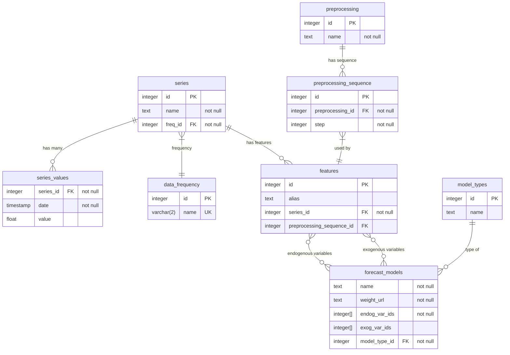

# Итоговая работа по SQL

## О предметной области:
Данный проект представляет собой схему сущностей в платформе моделирования и прогнозирования экономических временных рядов

**Он включает в себя сущности:**
- **Частотность ряда** (data_frequency):
  - Годовая (Y), квартальная (Q), ежемесячная (M) или ежедневная (D)
  - На начало периода (S) или на конец (E)
- **Временной ряд** (series) с названием, частотностью ряда и его значениями
- **Единица предобработки** (preprocessing) с названием
- **Последовательность предобработок** (preprocessing_sequence) с предобработкой и его номером в последовательности
- **Признак** (features) со ссылкой на временной ряд и опциональной последовательностью предобработкой
- **Прогнозная модель** (forecast_models) с эндогенными, экзогенными переменными, псевдонимом и ссылкой на веса модели (S3)

### Диаграмма сущностей выглядит так:

