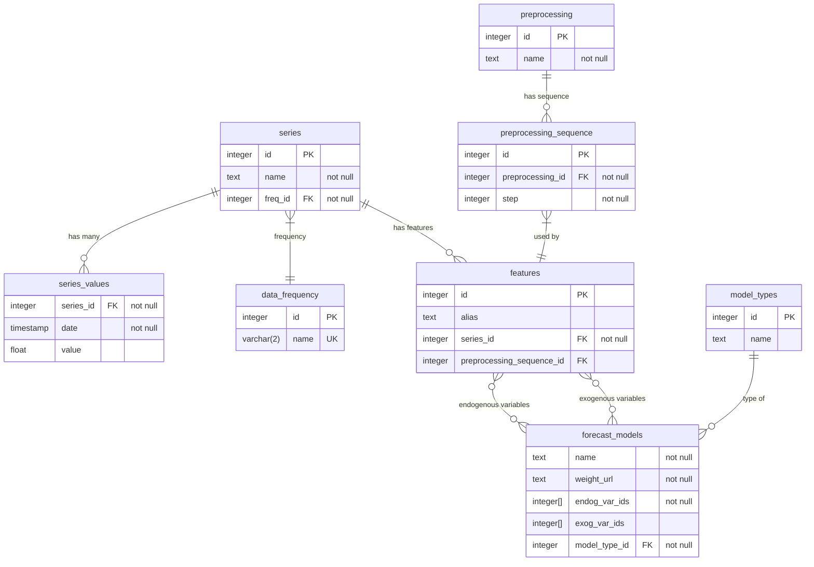

# Итоговая работа по SQL

## О предметной области:
Данный проект представляет собой схему сущностей в платформе моделирования и прогнозирования экономических временных рядов

**Он включает в себя сущности:**
- **Частотность ряда** (data_frequency):
  - Годовая (Y), квартальная (Q), ежемесячная (M) или ежедневная (D)
  - На начало периода (S) или на конец (E)
- **Временной ряд** (series) с названием, частотностью ряда и его значениями
- **Единица предобработки** (preprocessing) с названием
- **Последовательность предобработок** (preprocessing_sequence) с предобработкой и его номером в последовательности
- **Признак** (features) со ссылкой на временной ряд и опциональной последовательностью предобработкой
- **Прогнозная модель** (forecast_models) с эндогенными, экзогенными переменными, псевдонимом и ссылкой на веса модели (S3)

### Диаграмма сущностей выглядит так:


# Сценарии использования
Помимо очевидных сценариев, таких как добавление новой частотности или типа моделей, разберем популярные задачи в рамках платформы:

## Создание нового временного ряда
Задача состоит из 2 этапов: загрузки его метаданных (название, частотность) и загрузка значений:

Пользователь вводит частотность ряда и его название, в таблице создается новая запись:

```psql
WITH freq AS (
    SELECT id FROM data_frequency WHERE name = *Частотность ряда*
)
INSERT INTO series (name, freq_id) 
SELECT *Название ряда*, id 
FROM freq
RETURNING id
```

После успешной обработки формируется запрос на вставку данных:
```psql
INSERT INTO 
    series_values (series_id, date, value) 
VALUES 
  (*id ряда*, '2000-01-01', 60.98),
  (*id ряда*, '2000-01-02', 61.53),
  (*id ряда*, '2000-01-03', 65.23),
  ...
```

Чтобы не попадать в ловушку N+1 желательно загрузить данные одним запросом. 
Поскольку экономические ряды обычно маленькие (меньше 1000 строк), то операция не отразится на производительности платформы. Особенно с учетом того, что операции записи происходят достаточно редко

Две SQL команды также можно обернуть в одну транзакцию и исполнять одним запросом, лишившись расходов на сериализацию, десериализацию и на ввод-вывод, однако базовое решение удовлетворяет функциональным требованиям
## Добавление нового значения в временной ряд
Каждый месяц парсеры получают новые значения рядов, их добавление в базу будет выглядеть следующим образом:

```sql

INSERT INTO 
  series_values (series_id, date, value)
VALUES 
  (*id ряда*, *новая дата*, *новое значение*)
```

## Получение панели данных
В отличие от тривиальной задачи получения значений одного ряда, часто ставится получение панели: соеденить ряды в одну таблицу с общим индексом даты.

Для простоты будем считать что все данные одной частотности. Запрос можно сформировать на бэкенде из достаточно простого но эффективного:

Допустим, пользователь хочет обьеденить ряды с индексами id_1, id_2, id_3, ... Тогда на бэкенде сформируется следующий запрос:
Тогда аггрегировав данные по дате, у нас для каждого уникального айдишника будет не более 1 значения в каждый момент времени. Можно применить почти любую аггрегационную функцию для получения значения (MIN, MAX, SUM, AVG ...)
```psql
SELECT 
    date,
    MAX(CASE WHEN series_id = id_1 THEN value END) AS *Название ряда 1*,
    MAX(CASE WHEN series_id = id_2 THEN value END) AS *Название ряда 2*,
    MAX(CASE WHEN series_id = id_3 THEN value END) AS *Название ряда 3*,
    ... 
FROM series_values
WHERE series_id IN (id_1, id_2, id_3, ...)
GROUP BY date
ORDER BY date;
```

Её результатом и будет нужная панель:
| date | urals | dollar |
| --- | --- | --- |
| 1999-01-31 00:00:00 | 22.6 | [null] |
| 1999-02-28 00:00:00 | 22.86 | [null] |
| ... | ... | ... | ... |

## Сохранение прогнозной модели

1. На клиенте пользователь выбирает архитектуру и параметры своей прогнозной модели, выбирает экзогенные и эндогенные переменные
2. После чего нажимает кнопку "обучить"
3. Запрос отправляется в прогнозный сервис, из которого возвращается бинарная сериализация весов моделей (с расширением .pkl или .pth)
4. После успешной обработки прогнозного сервиса, нужно сохранить метаданные прогнозной модели:

```psql
INSERT INTO 
    forecast_models (name, weight_url, model_type_id)
VALUES 
  (*Название модели*, *ссылка на сохраненные веса модели*, *id введенной архитектуры модели*);
```

## Предобработка ряда
В предобработку ряда включается применение последовательности предобработок, а также сохранение записи в БД.

Предположим, в сервис было предложено имплементировать следующие предобработки:
- Взятие разностей
- Взятие логарифма
- Скользящее среднее с окном

Для каждой из них будет свой обработчик, который принимает на вход `id` ряда а результатом сохраняет обработанный ряд в `features`: 

Например скользящее среднее реализуется через оконную функцию `AVG `и группировку через `ROWS BETWEEN` с указанием границ окна:
```psql
SELECT 
	  date,
    AVG(value) OVER (ORDER BY date ROWS BETWEEN {N - 1} PRECEDING AND CURRENT ROW) as sma_{N}
FROM series_values
WHERE series_id = *ID ряда*
ORDER BY date
OFFSET {N - 1}
```
Взятие разностей работает по аналогии:

```psql
SELECT 
	date,
	value - LAG(value) OVER (ORDER BY date) as diff_value
FROM series_values
WHERE series_id = *ID ряда*
ORDER BY date
```

Логарифмирование проще:

```psql
SELECT 
	date,
	LOG(value) as log_value
FROM series_values
WHERE series_id = *ID ряда*
ORDER BY date
```

